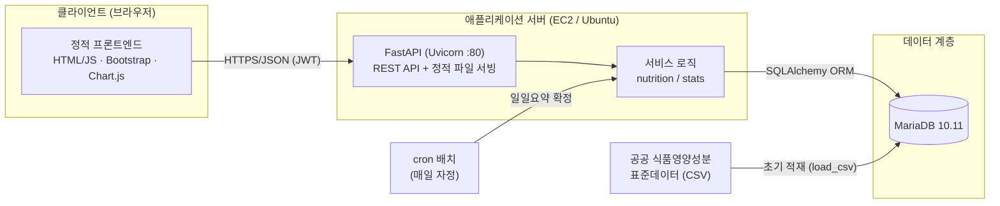
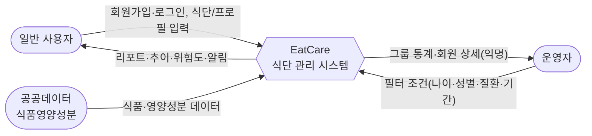
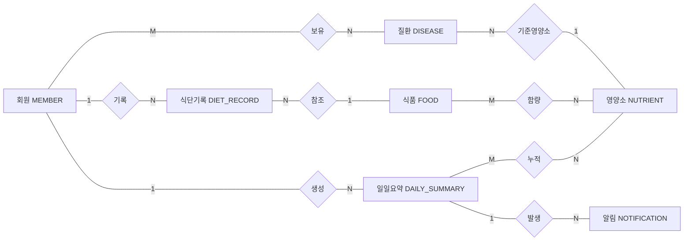
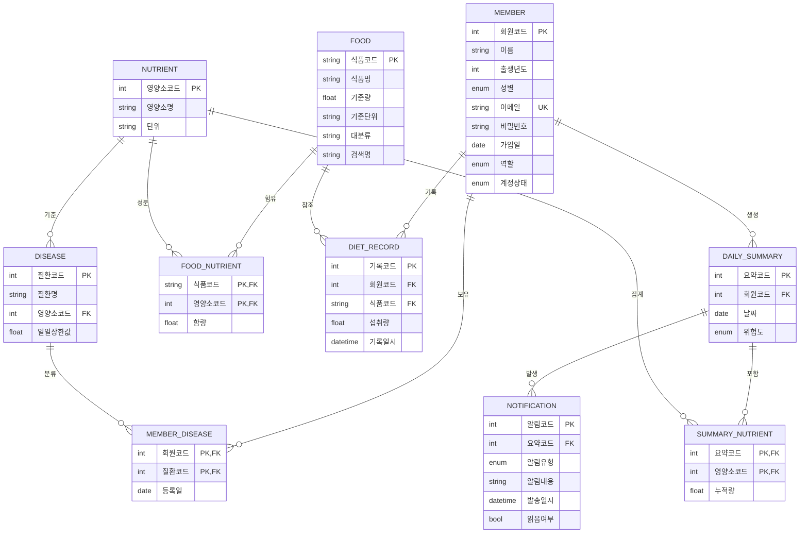
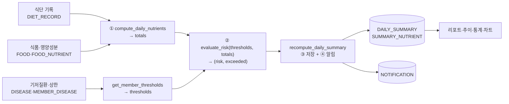
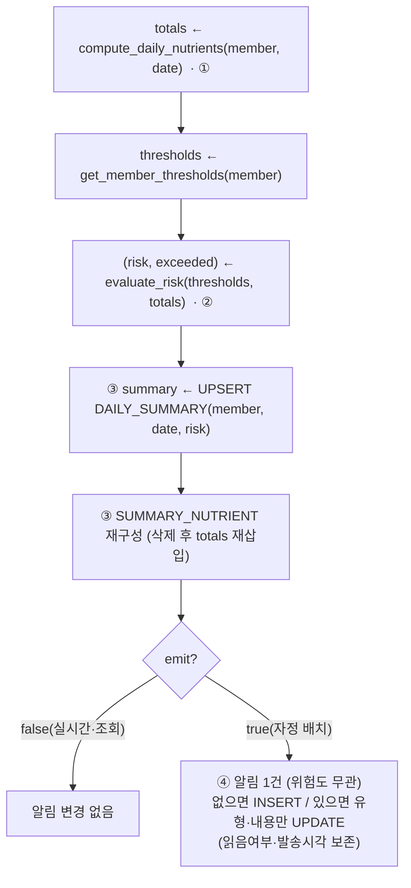

# EatCare — 개인 맞춤형 건강 및 식단 관리 시스템 · 시스템 명세서

> 정보시스템설계 · 5조 팀프로젝트
> 본 문서는 구현된 정보시스템(EatCare)의 설계·명세를 정리한 보고서로, 발표 자료 제작의 기준 문서로 사용한다.

---

## 목차

1. [개요](#1-개요)
2. [시스템의 목적·필요성·기대효과](#2-시스템의-목적필요성기대효과)
3. [이해관계자 및 사용자 유형](#3-이해관계자-및-사용자-유형)
4. [기능 요구사항](#4-기능-요구사항)
5. [시스템 아키텍처 및 기술 스택](#5-시스템-아키텍처-및-기술-스택)
6. [자료흐름도 (DFD)](#6-자료흐름도-dfd)
7. [개체-관계 모델 (ERD · Chen 표기법)](#7-개체-관계-모델-erd--chen-표기법)
8. [개체-관계 모델 (ERD · IE 표기법)](#8-개체-관계-모델-erd--ie-표기법)
9. [관계 스키마 및 데이터베이스 스키마](#9-관계-스키마-및-데이터베이스-스키마)
10. [핵심 처리 로직 · API 명세 · SQL](#10-핵심-처리-로직--api-명세--sql)
11. [데이터 출처 및 표본 데이터](#11-데이터-출처-및-표본-데이터)
12. [비기능 요구사항 (성능·보안·운영)](#12-비기능-요구사항-성능보안운영)
13. [향후 과제](#13-향후-과제)
14. [부록 — 용어/약어](#14-부록--용어약어)

---

## 1. 개요

| 항목 | 내용 |
|---|---|
| 시스템명 | **EatCare** (개인 맞춤형 건강 및 식단 관리 시스템) |
| 한 줄 정의 | 기저질환(당뇨·고혈압·고지혈증)을 가진 사용자가 식단을 기록하면, 질환별 기준 영양소의 일일 섭취량을 자동 집계·평가하여 **위험도와 알림**을 제공하는 웹 정보시스템 |
| 핵심 가치 | 식단 기록 → 영양소 누적 → 질환 기준 상한 대비 위험도 산정 → 알림/리포트 → 운영자 그룹 통계 |
| 대상 영양소 | 당류(g), 나트륨(mg), 지방(g) — 각 질환의 관리 기준 영양소 |
| 사용자 | 일반 사용자(USER), 운영자(ADMIN) |

EatCare는 "무엇을, 얼마나 먹었는가"를 손쉽게 기록하는 것에서 출발하여, 사용자의 **기저질환에 맞춘 영양 관리**를 자동화한다. 사용자는 본인의 식단·위험도·추이를 확인하고, 운영자는 익명화된 집계 데이터로 사용자 그룹의 건강 경향을 모니터링한다.

---

## 2. 시스템의 목적·필요성·기대효과

### 2.1 배경 및 필요성
- **만성질환 증가**: 당뇨·고혈압·고지혈증 등 식이 관련 만성질환 유병률이 지속 증가하고 있으며, 이들 질환은 특정 영양소(당류·나트륨·지방)의 과다 섭취와 밀접하다.
- **자가 관리의 어려움**: 일반인은 자신이 하루에 특정 영양소를 얼마나 섭취했는지, 그것이 자신의 질환 기준에 비추어 위험한지 직관적으로 알기 어렵다.
- **개인화의 부재**: 시중 식단 앱 다수는 단순 칼로리 위주이며, **개인의 기저질환별 기준**을 반영한 위험도 평가·알림 기능이 부족하다.
- **공공데이터 활용 기회**: 식품의약품안전처/공공데이터포털의 표준 식품영양성분 데이터를 활용하면 신뢰도 높은 영양 분석이 가능하다.

### 2.2 목적
1. 사용자가 식단을 간편하게 기록하고, **질환 맞춤 기준**으로 일일 영양 섭취를 자동 평가받는다.
2. 상한 대비 **위험도(정상/주의/위험/경고)** 를 산정하고, 매일 자정 그날의 평가 결과를 **알림**으로 발송하여 행동 변화를 유도한다.
3. 운영자가 **익명 집계 통계**(평균 섭취, 위험도 분포, 분포 히스토그램, 식품 분류 등)로 그룹 건강을 진단한다.

### 2.3 기대효과
| 구분 | 기대효과 |
|---|---|
| 사용자 | 질환 맞춤 영양 관리, 상한 초과 사전 인지, 섭취 추이 가시화로 자기 효능감 향상 |
| 운영자/보건관리자 | 그룹 단위 위험 인구 파악, 영양 교육·중재 대상 선별 근거 확보 |
| 데이터 측면 | 표준 공공데이터 기반의 일관된 영양 계산, 누적 데이터로 추세 분석 가능 |
| 사회적 | 식이 기반 만성질환의 예방적 관리에 기여 |

---

## 3. 이해관계자 및 사용자 유형

| 사용자 | 권한/역할 | 주요 행위 |
|---|---|---|
| **일반 사용자 (USER)** | 본인 데이터 CRUD | 회원가입/로그인, 프로필·기저질환 설정, 식단 기록, 일일 리포트·추이·알림 확인, 식품 정보 검색 |
| **운영자 (ADMIN)** | 익명 집계 열람(읽기 전용) | 그룹 필터링(나이·성별·질환·기간), 통계 리포트, 회원 상세(식별정보 제외) 열람, 식품 정보 검색 |
| **외부 데이터 공급원** | — | 공공 식품영양성분 표준데이터(CSV) 제공 |

> 운영자는 회원의 **이름·이메일 등 식별정보를 볼 수 없으며**, 회원코드 기반의 익명 데이터만 열람한다.

---

## 4. 기능 요구사항

### 4.1 사용자 기능
- **인증/계정**: 회원가입, 로그인(JWT), 프로필(이름·출생년도·성별) 수정.
- **기저질환 관리**: 당뇨·고혈압·고지혈증 보유 여부 선택(다중 가능).
- **식단 기록**: 식품명 검색(띄어쓰기 무시) → 섭취량(g) 입력 → 날짜별 기록 추가/삭제.
- **일일 영양 리포트**: 선택 날짜의 영양소별 섭취량을 일일 상한 대비 %로 시각화, 위험도 표시.
- **영양소 추이**: 최근 14일 일자별 섭취량 추이(상한 대비 %).
- **식품 분류별 섭취 횟수**: 최근 14일 섭취 식품의 대분류별 빈도.
- **알림함**: 매일 자정 배치가 발송한 그날의 영양 평가 알림(위험도 무관·1건) 열람·읽음 처리(최신순).
- **식품 정보 검색**: 식품의 100g당 영양성분 + 같은 분류 내 분포(상위 백분위) 조회.

### 4.2 운영자 기능
- **그룹 필터**: 나이 범위(슬라이더+나이대 버튼), 성별, 질환, 기간(달력+빠른 선택) 조합.
- **통계 리포트**: 위험도 분포(도넛), 영양소 평균 섭취량(막대), 영양소 기준 초과 비율, 영양소 섭취 분포(히스토그램+KDE), 식품 분류별 섭취 횟수.
- **회원 상세**: 정렬(번호·나이·성별·질환·위험도) 및 페이지네이션, 회원별 요약·식단기록·알림 열람(식별정보 제외).

### 4.3 자동/배치 기능
- **일일요약 자동 확정**: 매일 자정 cron 배치가 전 활성 회원의 전날 요약·위험도·알림을 확정.

---

## 5. 시스템 아키텍처 및 기술 스택

### 5.1 구성


### 5.2 기술 스택
| 계층 | 기술 |
|---|---|
| 프론트엔드 | 정적 HTML/JS, Bootstrap 5.3, Chart.js 4.4(+datalabels), noUiSlider, Pretendard 폰트, 토스 스타일 디자인, 다크모드 |
| 백엔드 | Python, FastAPI, Uvicorn(포트 80), SQLAlchemy ORM, PyMySQL |
| 인증 | JWT(python-jose), 비밀번호 해시 bcrypt |
| 데이터베이스 | MariaDB 10.11 (utf8mb4) |
| 인프라 | AWS EC2(Ubuntu), 단일 노드 배포 |
| 데이터 | 공공 식품영양성분 표준데이터(CSV) 적재 |

### 5.3 계층 구조(백엔드)
- `app/routers/*` : API 엔드포인트(auth, members, diet, reports, notifications, admin, foods)
- `app/services/nutrition.py` : 영양소 누적·위험도 평가·요약/알림 재계산(핵심 도메인 로직)
- `app/services/stats.py` : 운영자 그룹 통계(평균·분포·초과율·식품분류)
- `app/models.py` : ORM 모델(영문 속성 → 한글 컬럼 매핑)
- `scripts/*` : 초기 적재(load_csv), 인덱스 마이그레이션(add_indexes), 가상데이터(gen_data), 데모 계정(demo_user), 자정 배치(run_daily_summary)

---

## 6. 자료흐름도 (DFD)

### 6.1 배경도 (Context Diagram, Level 0)


### 6.2 Level 1 DFD
```mermaid
flowchart TB
  USER([일반 사용자])
  ADMIN([운영자])
  GOV([공공데이터])
  CRON([cron 배치 · 매일 자정])

  P1["1.0 인증·회원/질환 관리"]
  P2["2.0 식단 기록 관리"]
  P3["3.0 영양 누적·위험도 평가"]
  P4["4.0 알림 생성·관리"]
  P5["5.0 리포트·그룹 통계"]
  P6["6.0 식품 정보 검색"]

  D1[("D1 MEMBER / MEMBER_DISEASE")]
  D2[("D2 FOOD / NUTRIENT / FOOD_NUTRIENT / DISEASE")]
  D4[("D4 DIET_RECORD")]
  D5[("D5 DAILY_SUMMARY / SUMMARY_NUTRIENT")]
  D6[("D6 NOTIFICATION")]

  GOV --> D2

  USER -- "가입·로그인·질환선택" --> P1
  P1 <--> D1
  P1 -- "질환·상한 조회" --> D2

  USER -- "식품검색·섭취량" --> P2
  P2 -- "식품/영양성분 조회" --> D2
  P2 -- "기록 저장/삭제" --> D4
  P2 -- "변경 통지(실시간: 요약·위험도만)" --> P3
  CRON -- "전날 요약 확정 + 알림 발송" --> P3

  P3 -- "기록·식품·상한 조회" --> D4
  P3 -- "" --> D2
  P3 -- "요약/누적 upsert" --> D5
  P3 -- "자정 확정 시 알림 발송(위험도 무관·1건)" --> P4
  P4 <--> D6

  USER -- "리포트·추이·알림 요청" --> P5
  ADMIN -- "필터 조건" --> P5
  P5 -- "집계 조회" --> D5
  P5 -- "" --> D4
  P5 -- "" --> D1
  P5 -- "리포트/통계" --> USER
  P5 -- "그룹 통계·회원상세(익명)" --> ADMIN
  P4 -- "알림 목록" --> USER

  USER -- "식품 검색" --> P6
  ADMIN -- "식품 검색" --> P6
  P6 -- "영양성분·분포" --> D2
```

**프로세스 설명**
| 번호 | 프로세스 | 설명 |
|---|---|---|
| 1.0 | 인증·회원/질환 관리 | 회원가입/로그인(JWT 발급), 프로필·기저질환 설정 |
| 2.0 | 식단 기록 관리 | 식품 검색→섭취량 기록 추가/삭제, 변경 시 3.0 트리거 |
| 3.0 | 영양 누적·위험도 평가 | 일일 영양소 누적, Decision Table로 위험도 산정, 요약·위험도 갱신(실시간) / 자정 배치 시 알림까지 발송 |
| 4.0 | 알림 생성·관리 | 매일 자정 그날 평가 결과로 알림 발행(위험도 무관·1건, 읽음·발송시각 보존), 조회/읽음 처리 |
| 5.0 | 리포트·그룹 통계 | 사용자 리포트/추이, 운영자 그룹 통계·회원 상세 |
| 6.0 | 식품 정보 검색 | 식품 영양성분 + 동일 분류 내 분포(백분위) 조회 |

---

## 7. 개체-관계 모델 (ERD · Chen 표기법)

> 사각형=개체(Entity), 마름모=관계(Relationship), 간선 라벨=카디널리티. (원본 벡터 이미지: `nutrition_erd_chen.svg`)



**개체·주요 속성**
- **MEMBER(회원)**: 회원코드(PK), 이름, 출생년도, 성별, 이메일, 비밀번호, 가입일, 역할, 계정상태
- **DISEASE(질환)**: 질환코드(PK), 질환명, 일일상한값, {기준 영양소}
- **NUTRIENT(영양소)**: 영양소코드(PK), 영양소명, 단위
- **FOOD(식품)**: 식품코드(PK), 식품명, 기준량, 기준단위, 대분류
- **DIET_RECORD(식단기록)**: 기록코드(PK), 섭취량, 기록일시
- **DAILY_SUMMARY(일일요약)**: 요약코드(PK), 날짜, 위험도
- **NOTIFICATION(알림)**: 알림코드(PK), 알림유형, 알림내용, 발송일시, 읽음여부
- **연관개체(M:N)**: FOOD_NUTRIENT(함량), MEMBER_DISEASE(등록일), SUMMARY_NUTRIENT(누적량)

---

## 8. 개체-관계 모델 (ERD · IE 표기법)

> Crow's Foot(까마귀발) ≈ IE 표기법. `1`=일(부모), `N/다수`=다(자식). (원본 벡터 이미지: `nutrition_erd.svg`)



---

## 9. 관계 스키마 및 데이터베이스 스키마

### 9.1 관계 스키마 (밑줄=기본키, *=외래키)
```
NUTRIENT(영양소코드, 영양소명, 단위)
FOOD(식품코드, 식품명, 기준량, 기준단위, 대분류, 검색명*생성컬럼)
DISEASE(질환코드, 질환명, 영양소코드*, 일일상한값)
MEMBER(회원코드, 이름, 출생년도, 성별, 이메일, 비밀번호, 가입일, 역할, 계정상태)
FOOD_NUTRIENT(식품코드*, 영양소코드*, 함량)
MEMBER_DISEASE(회원코드*, 질환코드*, 등록일)
DIET_RECORD(기록코드, 회원코드*, 식품코드*, 섭취량, 기록일시)
DAILY_SUMMARY(요약코드, 회원코드*, 날짜, 위험도)          -- (회원코드, 날짜) UNIQUE
SUMMARY_NUTRIENT(요약코드*, 영양소코드*, 누적량)
NOTIFICATION(알림코드, 요약코드*, 알림유형, 알림내용, 발송일시, 읽음여부)
```

### 9.2 테이블 정의 요약
| 테이블 | 의미 | 주요 제약 |
|---|---|---|
| NUTRIENT | 영양소 마스터 | PK 영양소코드 |
| FOOD | 식품 마스터(공공데이터) | PK 식품코드(문자열), `검색명` STORED 생성컬럼, idx(대분류), idx(검색명) |
| DISEASE | 질환·기준 영양소·일일상한 | FK→NUTRIENT |
| MEMBER | 회원 | 이메일 UNIQUE, 역할/상태 ENUM |
| FOOD_NUTRIENT | 식품×영양소 함량(M:N) | 복합 PK, FK CASCADE |
| MEMBER_DISEASE | 회원×질환(M:N) | 복합 PK, FK CASCADE |
| DIET_RECORD | 식단 기록 | FK→MEMBER/FOOD, idx(회원코드,기록일시) |
| DAILY_SUMMARY | 일일 요약·위험도 | (회원코드,날짜) UNIQUE |
| SUMMARY_NUTRIENT | 요약×영양소 누적(M:N) | 복합 PK |
| NOTIFICATION | 위험도 알림 | FK→DAILY_SUMMARY |

### 9.3 DDL (MariaDB, utf8mb4)
```sql
-- 영양소
CREATE TABLE NUTRIENT (
  영양소코드 INT AUTO_INCREMENT PRIMARY KEY,
  영양소명   VARCHAR(50)  NOT NULL,
  단위       VARCHAR(20)  NOT NULL
);

-- 식품 (검색명 = 공백 제거 STORED 생성컬럼: 띄어쓰기 무시 검색 + 인덱스 활용)
CREATE TABLE FOOD (
  식품코드   VARCHAR(32)  PRIMARY KEY,
  식품명     VARCHAR(255) NOT NULL,
  기준량     FLOAT NOT NULL DEFAULT 100,
  기준단위   VARCHAR(20)  NOT NULL DEFAULT 'g',
  대분류     VARCHAR(50),
  검색명     VARCHAR(255) AS (REPLACE(식품명, ' ', '')) STORED,
  INDEX idx_food_category (대분류),
  INDEX idx_food_search (검색명)
);

-- 질환 (기준 영양소 1종 + 일일 상한값)
CREATE TABLE DISEASE (
  질환코드   INT AUTO_INCREMENT PRIMARY KEY,
  질환명     VARCHAR(50) NOT NULL,
  영양소코드 INT NOT NULL,
  일일상한값 FLOAT NOT NULL,
  CONSTRAINT fk_disease_nutrient FOREIGN KEY (영양소코드) REFERENCES NUTRIENT(영양소코드)
);

-- 회원
CREATE TABLE MEMBER (
  회원코드 INT AUTO_INCREMENT PRIMARY KEY,
  이름 VARCHAR(50) NOT NULL,
  출생년도 INT,
  성별 ENUM('M','F'),
  이메일 VARCHAR(255) NOT NULL UNIQUE,
  비밀번호 VARCHAR(255) NOT NULL,
  가입일 DATE NOT NULL,
  역할 ENUM('USER','ADMIN') NOT NULL DEFAULT 'USER',
  계정상태 ENUM('ACTIVE','INACTIVE') NOT NULL DEFAULT 'ACTIVE'
);

-- 식품-영양소 함량 (M:N)
CREATE TABLE FOOD_NUTRIENT (
  식품코드 VARCHAR(32) NOT NULL,
  영양소코드 INT NOT NULL,
  함량 FLOAT NOT NULL,
  PRIMARY KEY (식품코드, 영양소코드),
  CONSTRAINT fk_fn_food FOREIGN KEY (식품코드) REFERENCES FOOD(식품코드) ON DELETE CASCADE,
  CONSTRAINT fk_fn_nutrient FOREIGN KEY (영양소코드) REFERENCES NUTRIENT(영양소코드) ON DELETE CASCADE
);

-- 회원-질환 (M:N)
CREATE TABLE MEMBER_DISEASE (
  회원코드 INT NOT NULL,
  질환코드 INT NOT NULL,
  등록일 DATE NOT NULL,
  PRIMARY KEY (회원코드, 질환코드),
  CONSTRAINT fk_md_member FOREIGN KEY (회원코드) REFERENCES MEMBER(회원코드) ON DELETE CASCADE,
  CONSTRAINT fk_md_disease FOREIGN KEY (질환코드) REFERENCES DISEASE(질환코드) ON DELETE CASCADE
);

-- 식단기록
CREATE TABLE DIET_RECORD (
  기록코드 INT AUTO_INCREMENT PRIMARY KEY,
  회원코드 INT NOT NULL,
  식품코드 VARCHAR(32) NOT NULL,
  섭취량 FLOAT NOT NULL,
  기록일시 DATETIME NOT NULL,
  CONSTRAINT fk_dr_member FOREIGN KEY (회원코드) REFERENCES MEMBER(회원코드) ON DELETE CASCADE,
  CONSTRAINT fk_dr_food FOREIGN KEY (식품코드) REFERENCES FOOD(식품코드),
  INDEX idx_dr_member_date (회원코드, 기록일시)
);

-- 일일요약
CREATE TABLE DAILY_SUMMARY (
  요약코드 INT AUTO_INCREMENT PRIMARY KEY,
  회원코드 INT NOT NULL,
  날짜 DATE NOT NULL,
  위험도 ENUM('정상','주의','위험','경고') NOT NULL DEFAULT '정상',
  UNIQUE KEY uk_summary_member_date (회원코드, 날짜),
  CONSTRAINT fk_ds_member FOREIGN KEY (회원코드) REFERENCES MEMBER(회원코드) ON DELETE CASCADE
);

-- 요약-영양소 누적 (M:N)
CREATE TABLE SUMMARY_NUTRIENT (
  요약코드 INT NOT NULL,
  영양소코드 INT NOT NULL,
  누적량 FLOAT NOT NULL,
  PRIMARY KEY (요약코드, 영양소코드),
  CONSTRAINT fk_sn_summary FOREIGN KEY (요약코드) REFERENCES DAILY_SUMMARY(요약코드) ON DELETE CASCADE,
  CONSTRAINT fk_sn_nutrient FOREIGN KEY (영양소코드) REFERENCES NUTRIENT(영양소코드) ON DELETE CASCADE
);

-- 알림
CREATE TABLE NOTIFICATION (
  알림코드 INT AUTO_INCREMENT PRIMARY KEY,
  요약코드 INT NOT NULL,
  알림유형 ENUM('NORMAL','WARNING','DANGER','CRITICAL') NOT NULL,
  알림내용 VARCHAR(255) NOT NULL,
  발송일시 DATETIME NOT NULL,
  읽음여부 BOOLEAN NOT NULL DEFAULT FALSE,
  CONSTRAINT fk_noti_summary FOREIGN KEY (요약코드) REFERENCES DAILY_SUMMARY(요약코드) ON DELETE CASCADE
);
```

### 9.4 인덱스 설계 (성능)
| 인덱스 | 대상 | 목적 |
|---|---|---|
| `idx_dr_member_date` | DIET_RECORD(회원코드, 기록일시) | 회원·기간 조회/집계 가속 |
| `uk_summary_member_date` | DAILY_SUMMARY(회원코드, 날짜) UNIQUE | 1일 1요약 보장 + 최신요약 조회 |
| `idx_food_category` | FOOD(대분류) | 식품 분류별 분포/집계 |
| `idx_food_search` | FOOD(검색명) | 공백 무시 식품 검색(커버링 인덱스 스캔) |

### 9.5 기준 데이터 (DISEASE)
| 질환 | 기준 영양소 | 일일 상한 |
|---|---|---|
| 당뇨 | 당류 | 50 g |
| 고혈압 | 나트륨 | 2000 mg |
| 고지혈증 | 지방 | 60 g |

---

## 10. 핵심 처리 로직 · API 명세 · SQL

본 장은 처리 로직을 **API 단위로** 정리하되, 모든 함수·변수·SQL 파라미터가 **하나의 일관된 이름 체계**로 연결되도록 구성한다. 각 엔드포인트는 **(1) 명세(메서드·경로·권한) → (2) 처리 로직(의사코드/결정표/수식) → (3) 수반 SQL** 순으로 제시한다. 여러 API가 공유하는 **공통 평가 파이프라인**은 §10.2에 한 번 정의하고(함수 5개), 각 API는 이를 호출만 한다.

### 10.1 개요 · 이름 사전(공통 어휘)



본 장 전체에서 아래 세 사전(함수·데이터·SQL 파라미터)의 이름을 그대로 사용한다. **의사코드·산문·SQL이 모두 같은 식별자**를 쓰므로, 한 이름을 따라가면 입력→계산→저장→질의가 한 줄로 이어진다.

#### (가) 함수 사전 — 공통 파이프라인 (§10.2에서 정의)
| 단계 | 함수 | 입력 | 출력 | 기록 테이블 |
|:---:|---|---|---|---|
| ① | `compute_daily_nutrients(member, date)` | 회원·날짜 | `totals` | — (조회) |
| — | `get_member_thresholds(member)` | 회원 | `thresholds` | — (조회) |
| ② | `evaluate_risk(thresholds, totals)` | 임계치·누적 | `(risk, exceeded)` | — (판정) |
| — | `build_message(exceeded)` | 초과 목록 | `알림내용` 문자열 | — |
| ③④ | `recompute_daily_summary(member, date, sent_at, emit)` | 회원·날짜·플래그 | `summary` | DAILY_SUMMARY·SUMMARY_NUTRIENT·NOTIFICATION |

> `recompute_daily_summary`가 ①②를 내부에서 호출한 뒤 ③(요약·누적 저장)·④(알림, `emit=true`일 때만)를 수행하는 **오케스트레이터**다.

#### (나) 데이터 사전 — 변수와 구조
| 변수 | 구조 | 의미 |
|---|---|---|
| `totals` | `{ 영양소코드 → 누적량 }` | 그날 영양소별 누적 섭취량(① 결과) |
| `thresholds` | `[ { 영양소코드, 영양소명, 단위, 일일상한값 } ]` | 회원이 보유한 질환의 기준 영양소·상한 |
| `risk` | `"정상"/"주의"/"위험"/"경고"` | 위험도 등급(② 결과) |
| `exceeded` | `[ { 질환, 영양소명, 단위, 누적섭취, 일일상한값 } ]` | 상한을 넘긴 영양소 목록(② 결과) |
| `summary` | `DAILY_SUMMARY` 1행 | `(회원코드, 날짜)` 단위 그날 요약 |

#### (다) SQL 파라미터 사전 — `:이름` 바인드 변수
`:이름`은 named bind parameter(이름 있는 바인드 변수)로, SQLAlchemy `text()`/Oracle/JPA에서 쓰는 표기다(드라이버에 따라 위치 마커 `?`로 변환). 본 장은 **단수형=단일 값, 복수형=`IN (...)` 목록** 규칙으로 통일한다.

| 파라미터 | 의미 | | 파라미터 | 의미 |
|---|---|---|---|---|
| `:member` | 회원코드(단일) | | `:members` | 회원코드 목록(IN) |
| `:date` | 대상 날짜 | | `:start` `:end` | 기간(시작·끝) |
| `:food` | 식품코드 | | `:foods` | 식품코드 목록(IN) |
| `:disease` | 질환코드 | | `:nutrient` | 영양소코드 |
| `:record` | 기록코드 | | `:notification` | 알림코드 |
| `:summary` | 요약코드(단일) | | `:summaries` | 요약코드 목록(IN) |
| `:category` | 식품 대분류 | | `:kw1, :kw2 …` | 검색어 토큰(공백 분리) |
| `:limit` | 결과 개수 제한 | | `:gender` `:age_min` `:age_max` | 회원 필터 |

쓰기용 값 파라미터: `:email :name :birth_year :gender :pw_hash`(가입), `:amount :recorded_at`(식단), `:risk :total`(요약), `:type :content :sent_at`(알림).

`[ ... ]`는 조건부로만 추가되는 절(節)이다. SQL의 한글 컬럼명은 실제 DB 스키마(§9)와 동일하다.

#### 엔드포인트 한눈에 보기
| § | Method | Path | 권한 | 핵심 SQL 동작 |
|---|---|---|---|---|
| 10.3 | POST | `/api/auth/signup` | 공개 | `SELECT`(중복) + `INSERT MEMBER` |
| 10.3 | POST | `/api/auth/login` | 공개 | `SELECT MEMBER`(+bcrypt 검증) |
| 10.4 | GET | `/api/members/me` | USER | `SELECT MEMBER` |
| 10.4 | PUT | `/api/members/me` | USER | `UPDATE MEMBER` |
| 10.4 | GET | `/api/members/diseases` | USER | `DISEASE ⋈ NUTRIENT` |
| 10.4 | GET | `/api/members/me/diseases` | USER | `MEMBER_DISEASE ⋈ DISEASE` |
| 10.4 | POST | `/api/members/me/diseases` | USER | `INSERT MEMBER_DISEASE`(중복 방지) |
| 10.4 | DELETE | `/api/members/me/diseases/{disease}` | USER | `DELETE MEMBER_DISEASE` |
| 10.5 | GET | `/api/diet/foods?q=` | USER | `FOOD` 공백무시 LIKE 검색 |
| 10.5 | POST | `/api/diet/records` | USER | `INSERT DIET_RECORD` → `recompute_daily_summary`(알림 X) |
| 10.5 | GET | `/api/diet/records?date=` | USER | `SELECT DIET_RECORD`(+영양소 일괄) |
| 10.5 | DELETE | `/api/diet/records/{record}` | USER | `DELETE DIET_RECORD` → `recompute_daily_summary`(알림 X) |
| 10.5 | GET | `/api/diet/category-summary?days=` | USER | `DIET_RECORD ⋈ FOOD` GROUP BY 대분류 |
| 10.5 | GET | `/api/reports/daily?date=` | USER | ① 누적 + ② 위험도 |
| 10.5 | GET | `/api/reports/trend?days=` | USER | `DAILY_SUMMARY`+`SUMMARY_NUTRIENT` |
| 10.5 | GET | `/api/notifications` | USER | `NOTIFICATION ⋈ DAILY_SUMMARY` |
| 10.5 | POST | `/api/notifications/{notification}/read` | USER | `UPDATE NOTIFICATION`(소유권 확인) |
| 10.6 | GET | `/api/foods/search?q=` | USER | `FOOD` 공백무시 LIKE 검색 |
| 10.6 | GET | `/api/foods/{food}` | USER | `FOOD_NUTRIENT ⋈ NUTRIENT` |
| 10.6 | GET | `/api/foods/{food}/distribution` | USER | 동일 대분류 100g 정규화 분포 |
| 10.7 | GET | `/api/admin/report` | ADMIN | 필터 → 평균맵 1회 → 다중 통계 |
| 10.7 | GET | `/api/admin/members` | ADMIN | 필터 + 윈도우 함수 최신요약 |
| 10.7 | GET | `/api/admin/members/{member}` | ADMIN | 요약·기록·알림(식별정보 제외) |
| 10.8 | (cron) | `run_daily_summary.py` | 배치 | 전 활성 회원 전날 `recompute_daily_summary`(알림 O) |

---

### 10.2 공통 평가 파이프라인 (여러 API가 공유)

식단 기록 추가/삭제(§10.5), 일일 리포트(§10.5), 자정 배치(§10.8)가 공유하는 핵심 계산이다. 단계 번호 ①②③④ 와 (가)~(다) 사전의 이름을 그대로 사용한다.

#### 10.2.1 단계 ① 일일 영양소 누적 — `compute_daily_nutrients` → `totals`
그날의 모든 식단기록을 식품·영양성분과 연결해 합산한다. 영양성분은 "기준량(보통 100g)당 함량"으로 저장되므로 실제 섭취량 비율로 환산한다.

$$\texttt{totals}(n) = \sum_{r \,\in\, \text{당일기록}} \text{함량}(r.\text{식품},\, n)\times \frac{r.\text{섭취량}}{\text{기준량}(r.\text{식품})}$$

```sql
-- 반환 행(영양소코드, 누적량) → 코드에서 totals = { 영양소코드 → 누적량 } 으로 적재
SELECT fn.영양소코드, SUM(fn.함량 * dr.섭취량 / NULLIF(f.기준량,0)) AS 누적량
FROM DIET_RECORD dr
JOIN FOOD f           ON dr.식품코드 = f.식품코드
JOIN FOOD_NUTRIENT fn ON fn.식품코드 = f.식품코드
WHERE dr.회원코드 = :member AND DATE(dr.기록일시) = :date
GROUP BY fn.영양소코드;
```

**계산 예시** — 어떤 사용자가 하루에 다음을 먹었다고 하자(영양성분은 100g 기준).

| 식품 | 섭취량 | 당류(100g) | 나트륨(100g) | → 당류 기여 | → 나트륨 기여 |
|---|---:|---:|---:|---:|---:|
| 콤비네이션 피자 | 250 g | 4.8 g | 441 mg | 12.0 g | 1,102.5 mg |
| 초코우유 | 300 g | 9.0 g | 60 mg | 27.0 g | 180 mg |
| 라면 | 200 g | 2.0 g | 900 mg | 4.0 g | 1,800 mg |
| **`totals`** | | | | **당류 43.0 g** | **나트륨 3,082.5 mg** |

> 환산식: (함량 × 섭취량 ÷ 기준량). 예) 피자 당류 = 4.8 × 250 ÷ 100 = 12.0 g.

#### 10.2.2 단계 ② 위험도 판정 — `evaluate_risk(thresholds, totals)` → `(risk, exceeded)`
회원의 `thresholds`(보유 질환의 기준 영양소·상한) 중 `totals` 가 일일 상한을 **초과(>)** 한 개수로 `risk` 를 정한다. `thresholds` 는 `get_member_thresholds(member)` 가 만든다.

```sql
-- get_member_thresholds(member): thresholds = [ {영양소코드, 영양소명, 단위, 일일상한값} ]
SELECT d.영양소코드, n.영양소명, n.단위, d.일일상한값
FROM MEMBER_DISEASE md
JOIN DISEASE d  ON d.질환코드 = md.질환코드
JOIN NUTRIENT n ON n.영양소코드 = d.영양소코드
WHERE md.회원코드 = :member;
```

> **`thresholds` 의 정의**: 질환이 없으면 평가 대상이 없어 `exceeded` 가 비고 `risk = "정상"`. 예) 당뇨 보유 → `{영양소=당류, 일일상한값=50 g}`.

**(A) 초과 개수 기반 결정표** — `risk = RISK_LEVELS[min(len(exceeded), 3)]`
| `len(exceeded)` | `risk` | 알림유형 | 의미 |
|:---:|:---:|:---:|---|
| 0 | 정상 | NORMAL | 모든 기준 영양소가 상한 이내 |
| 1 | 주의 | WARNING | 1개 초과 |
| 2 | 위험 | DANGER | 2개 초과 |
| ≥ 3 | 경고 | CRITICAL | 3개 이상 초과 |

**(B) 조건 매트릭스** (해당 질환을 보유한 경우에만 조건이 평가됨)
- C1 = (당뇨 보유) ∧ (`totals`[당류] > 50 g)
- C2 = (고혈압 보유) ∧ (`totals`[나트륨] > 2000 mg)
- C3 = (고지혈증 보유) ∧ (`totals`[지방] > 60 g)

| 규칙 | C1 | C2 | C3 | `len(exceeded)` | `risk` |
|:---:|:---:|:---:|:---:|:---:|:---:|
| R1 | F | F | F | 0 | 정상 |
| R2 | T | F | F | 1 | 주의 |
| R3 | F | T | F | 1 | 주의 |
| R4 | F | F | T | 1 | 주의 |
| R5 | T | T | F | 2 | 위험 |
| R6 | T | F | T | 2 | 위험 |
| R7 | F | T | T | 2 | 위험 |
| R8 | T | T | T | 3 | 경고 |

**적용 예시** — §10.2.1의 사용자가 **당뇨 + 고혈압** 보유자라면: `thresholds` = {당류 50 g, 나트륨 2000 mg}. `totals`[당류]=43 g ≤ 50(미초과), `totals`[나트륨]=3,082.5 mg > 2000(초과). `len(exceeded)`=1 → `risk`=**주의(WARNING)**.

#### 10.2.3 단계 ③④ 저장·알림 — `recompute_daily_summary` → `summary`

`recompute_daily_summary(member, date, sent_at, emit)` 는 ①②를 호출해 `totals`·`risk`·`exceeded` 를 구한 뒤, **③ 요약·누적 저장** 과 **④ 알림 발송**(`emit=true`일 때만)을 수행한다.

**산출물**
| 산출물 | 단위 | 의미 |
|---|---|---|
| `DAILY_SUMMARY`(`summary`) | (회원, 날짜) **1행** | 그날의 `risk`. `(회원코드,날짜)` UNIQUE |
| `SUMMARY_NUTRIENT` | (요약, 영양소) | `totals` 스냅샷(차트·리포트 재사용) |
| `NOTIFICATION` | (요약) **1행** | 자정 배치가 `risk`·`build_message(exceeded)` 로 **위험도와 무관하게 1건** 발송 |

**`emit`(=`emit_notifications`) 플래그 — 위험도 갱신과 알림 발송의 분리**
| 트리거 | 시점 | ③ 요약·위험도 | ④ 알림(`emit`) |
|---|---|:---:|:---:|
| 실시간 — 식단 추가/삭제 | 기록 변경 시 | O (즉시) | **X (false)** |
| 리포트 조회 | `/api/reports/daily` | O (값 최신화) | X (false) |
| 자정 배치 | 매일 00:00 cron | O (전날 확정) | **O (true)** — 알림이 생성되는 유일한 지점 |

이렇게 분리하면 하루 중 식단이 오르내려도 알림이 반복 생성·초기화되지 않아 **읽음 여부·발송시각이 안정적으로 유지**된다.

**처리 단계** (같은 입력이면 몇 번을 호출해도 결과가 동일 → 중복 호출·배치 재실행에 안전)


**④ 알림 규칙** (배치 재실행에 안전 — 통째 삭제/재생성하지 않음)
| 상황 (자정 배치) | 동작 | 읽음여부 | 발송시각 |
|---|---|:---:|:---:|
| 그날 알림 없음 | `INSERT`(유형 = `RISK_TO_NOTI_TYPE[risk]`) | 미읽음 | `:sent_at`(≈자정) |
| 그날 알림 있음 | 알림유형·알림내용만 `UPDATE` | **보존** | **보존** |
| 실시간/조회(`emit=false`) | 변경 없음 | 보존 | 보존 |

```sql
-- ③ 요약 upsert((회원코드,날짜) UNIQUE) — risk 는 §10.2.2 결과
INSERT INTO DAILY_SUMMARY (회원코드, 날짜, 위험도) VALUES (:member, :date, :risk)
  ON DUPLICATE KEY UPDATE 위험도 = VALUES(위험도);      -- → summary
-- ③ totals 스냅샷 재구성(삭제 후 영양소별 재삽입)
DELETE FROM SUMMARY_NUTRIENT WHERE 요약코드 = :summary;
INSERT INTO SUMMARY_NUTRIENT (요약코드, 영양소코드, 누적량) VALUES (:summary, :nutrient, :total);
-- ④ (emit=true) 알림 1건 — 위험도와 무관, 그날 알림 없을 때만 INSERT
INSERT INTO NOTIFICATION (요약코드, 알림유형, 알림내용, 발송일시, 읽음여부)
VALUES (:summary, :type, :content, :sent_at, 0);
-- 이미 있으면: UPDATE NOTIFICATION SET 알림유형=:type, 알림내용=:content WHERE 요약코드=:summary
```

#### 10.2.4 통합 의사코드 (위 이름 그대로)
```text
RISK_LEVELS        ← ["정상","주의","위험","경고"]
RISK_TO_NOTI_TYPE  ← {"정상":"NORMAL","주의":"WARNING","위험":"DANGER","경고":"CRITICAL"}

FUNCTION compute_daily_nutrients(member, date) -> totals:
    RETURN { 영양소코드 → SUM(함량 × 섭취량 / 기준량) }      # §10.2.1 SQL

FUNCTION get_member_thresholds(member) -> thresholds:
    RETURN [ {영양소코드, 영양소명, 단위, 일일상한값} ]        # §10.2.2 SQL

FUNCTION evaluate_risk(thresholds, totals) -> (risk, exceeded):
    exceeded ← [ t FOR t IN thresholds IF totals.get(t.영양소코드, 0) > t.일일상한값 ]
    risk     ← RISK_LEVELS[ MIN(LEN(exceeded), 3) ]
    RETURN (risk, exceeded)

FUNCTION build_message(exceeded) -> 알림내용:
    IF exceeded is empty:
        RETURN "오늘 섭취한 영양소가 모두 일일 상한 이내입니다. (위험도: 정상)"
    RETURN "일일 상한 초과: " + JOIN(", ",
            [ f"{e.영양소명} {e.누적섭취}{e.단위}(상한 {e.일일상한값}{e.단위})" FOR e IN exceeded ])

# 실시간 식단 추가/삭제·리포트 조회 → emit=false (③만)
# 자정 배치                         → emit=true  (③ + ④)
FUNCTION recompute_daily_summary(member, date, sent_at=now(), emit=true) -> summary:
    totals           ← compute_daily_nutrients(member, date)          # ①
    thresholds       ← get_member_thresholds(member)
    (risk, exceeded) ← evaluate_risk(thresholds, totals)              # ②

    summary ← save_daily_summary(member, date, risk)                  # ③ (회원,날짜) 1행 저장·갱신
    save_nutrient_totals(summary, totals)                             # ③ totals 스냅샷 재저장

    IF emit:                                                          # ④ 자정 배치만, 위험도 무관 1건
        upsert_notification(summary, RISK_TO_NOTI_TYPE[risk], build_message(exceeded), sent_at)
    RETURN summary
# 저장 연산(save_*/upsert_*)의 실제 SQL과 멱등 규칙(UPSERT·삭제 후 재삽입·읽음/발송시각 보존)은 §10.2.3 참조
```

---

### 10.3 인증 API

#### POST `/api/auth/signup` — 회원가입 + JWT 발급 (공개)
- 요청 `{name, email, password, birth_year, gender}` → 응답 `{access_token, role}`
- 로직:
```text
email ← trim(email)
IF EXISTS(MEMBER WHERE 이메일=email): RETURN 400 "이미 등록된 이메일"
INSERT MEMBER(..., 비밀번호=bcrypt(password), 역할='USER', 계정상태='ACTIVE')
RETURN { access_token: JWT(member), role: 'USER' }
```
- SQL:
```sql
SELECT 1 FROM MEMBER WHERE 이메일 = :email LIMIT 1;           -- 중복 확인
INSERT INTO MEMBER (이름, 이메일, 비밀번호, 출생년도, 성별, 가입일, 역할, 계정상태)
VALUES (:name, :email, :pw_hash, :birth_year, :gender, CURRENT_DATE, 'USER', 'ACTIVE');
```

#### POST `/api/auth/login` — 로그인 + JWT 발급 (공개)
- 요청(form) `username`(=이메일), `password`
- 로직(결정표):

| 조건 | 응답 |
|---|---|
| 이메일 없음 또는 비밀번호(bcrypt) 불일치 | 401 |
| 계정상태 ≠ `ACTIVE` | 403 |
| 그 외 | 200 + JWT |

- SQL:
```sql
SELECT 회원코드, 비밀번호, 계정상태, 역할 FROM MEMBER WHERE 이메일 = :email;
-- 애플리케이션에서 bcrypt.verify(password, 비밀번호) 및 계정상태='ACTIVE' 확인 후 토큰 발급
```

---

### 10.4 회원/질환 API (USER)

#### GET `/api/members/me` — 내 프로필
```sql
SELECT 회원코드, 이름, 이메일, 출생년도, 성별, 역할 FROM MEMBER WHERE 회원코드 = :member;
```

#### PUT `/api/members/me` — 프로필 수정(전달된 필드만)
```sql
UPDATE MEMBER SET 이름 = :name, 출생년도 = :birth_year, 성별 = :gender
WHERE 회원코드 = :member;     -- NULL로 전달된 항목은 SET 절에서 제외(동적 구성)
```

#### GET `/api/members/diseases` — 질환 카탈로그(기준 영양소·상한)
```sql
SELECT d.질환코드, d.질환명, n.영양소명, n.단위, d.일일상한값
FROM DISEASE d JOIN NUTRIENT n ON n.영양소코드 = d.영양소코드;
```

#### GET `/api/members/me/diseases` — 내 기저질환
```sql
SELECT md.질환코드, d.질환명, md.등록일
FROM MEMBER_DISEASE md JOIN DISEASE d ON d.질환코드 = md.질환코드
WHERE md.회원코드 = :member;
```

#### POST `/api/members/me/diseases` — 기저질환 추가(중복 방지)
- 로직:
```text
IF NOT EXISTS(DISEASE WHERE 질환코드=:disease): RETURN 404
IF NOT EXISTS(MEMBER_DISEASE WHERE 회원코드=:member AND 질환코드=:disease):
    INSERT MEMBER_DISEASE(:member, :disease, CURRENT_DATE)
RETURN 내 기저질환 목록
```
- SQL:
```sql
SELECT 1 FROM DISEASE WHERE 질환코드 = :disease LIMIT 1;                          -- 존재 확인
SELECT 1 FROM MEMBER_DISEASE WHERE 회원코드 = :member AND 질환코드 = :disease LIMIT 1;  -- 중복 확인
INSERT INTO MEMBER_DISEASE (회원코드, 질환코드, 등록일) VALUES (:member, :disease, CURRENT_DATE);
```

#### DELETE `/api/members/me/diseases/{disease}`
```sql
DELETE FROM MEMBER_DISEASE WHERE 회원코드 = :member AND 질환코드 = :disease;
```

---

### 10.5 식단·리포트·알림 API (USER)

#### GET `/api/diet/foods?q=` — 식단 기록용 식품 검색(공백 무시)
- 로직 — **공백 무시 토큰 매칭**: FOOD에 공백 제거 생성컬럼 `검색명 = REPLACE(식품명,' ','')`(STORED, 인덱스)을 두고, 검색어를 공백으로 토큰(`:kw1, :kw2, …`) 분리해 각 토큰을 `검색명` 에 `AND LIKE` 한다. 짧은 이름을 우선 노출.
```text
query ← SELECT * FROM FOOD
FOR kw IN split_whitespace(q):                  # kw1, kw2, ...
    query ← query WHERE 검색명 LIKE '%'+kw+'%'   # 모든 토큰 포함(AND)
RETURN query ORDER BY CHAR_LENGTH(식품명), 식품명 LIMIT :limit
```
- SQL (예: `q="바나나 우유"` → `:kw1='바나나', :kw2='우유'`):
```sql
SELECT 식품코드, 식품명, 기준량, 기준단위
FROM FOOD
WHERE 검색명 LIKE CONCAT('%', :kw1, '%')
  AND 검색명 LIKE CONCAT('%', :kw2, '%')      -- 토큰 수만큼 AND 누적
ORDER BY CHAR_LENGTH(식품명), 식품명
LIMIT :limit;   -- 검색명 생성컬럼 인덱스 → REPLACE 재계산 없이 커버링 스캔
```
> DB `"바나나 우유"` ↔ 검색 `"바나나우유"`/`"우유 바나나"` 모두 매칭(순서·붙여쓰기 무관).

#### POST `/api/diet/records` — 식단 기록 추가 → `recompute_daily_summary`(**알림 미발송**)
- 로직:
```text
IF NOT EXISTS(FOOD WHERE 식품코드=:food): RETURN 404
INSERT DIET_RECORD(:member, :food, :amount, :recorded_at)
recompute_daily_summary(member, date(:recorded_at), emit=FALSE)   # §10.2 — 알림 X
```
- SQL:
```sql
SELECT 1 FROM FOOD WHERE 식품코드 = :food LIMIT 1;               -- 식품 존재 확인
INSERT INTO DIET_RECORD (회원코드, 식품코드, 섭취량, 기록일시)
VALUES (:member, :food, :amount, :recorded_at);
-- 이어서 recompute_daily_summary(emit=false): §10.2.1 ① → §10.2.2 ② → §10.2.3 ③ (알림 ④ 생략)
```

#### GET `/api/diet/records?date=` — 날짜별 기록(영양소·분류 포함)
```sql
SELECT * FROM DIET_RECORD
WHERE 회원코드 = :member [AND DATE(기록일시) = :date]
ORDER BY 기록일시 DESC LIMIT 200;
-- 표시용 영양소(섭취량 환산)는 식품코드 묶음으로 일괄 조회(N+1 제거)
SELECT fn.식품코드, n.영양소명, n.단위, fn.함량
FROM FOOD_NUTRIENT fn JOIN NUTRIENT n ON n.영양소코드 = fn.영양소코드
WHERE fn.식품코드 IN (:foods);
```

#### DELETE `/api/diet/records/{record}` — 본인 기록 삭제 → `recompute_daily_summary`(**알림 미발송**)
```sql
SELECT * FROM DIET_RECORD WHERE 기록코드 = :record AND 회원코드 = :member;  -- 소유권 확인
DELETE FROM DIET_RECORD WHERE 기록코드 = :record;
-- 이후 recompute_daily_summary(emit=FALSE) — §10.2.3 ③과 동일
```

#### GET `/api/diet/category-summary?days=` — 본인 식품 분류별 섭취 횟수(상위 8)
```sql
SELECT COALESCE(f.대분류, '미분류') AS category, COUNT(*) AS cnt
FROM DIET_RECORD dr JOIN FOOD f ON f.식품코드 = dr.식품코드
WHERE dr.회원코드 = :member [AND dr.기록일시 >= :start]
GROUP BY category ORDER BY cnt DESC LIMIT 8;
```

#### GET `/api/reports/daily?date=` — 일일 영양 리포트(요약 갱신, **알림 미생성**)
- 로직: `recompute_daily_summary(emit=FALSE)` → `totals`(①) + `(risk, exceeded)`(②) → 영양소별 (누적/상한/초과/모니터링여부) 구성.
- SQL: §10.2.1 `totals` 조회 + §10.2.2 `thresholds` 조회 + 표준 상한(표시용)
```sql
SELECT 영양소코드, 일일상한값 FROM DISEASE;   -- 모든 질환 정의(표시용 표준 상한)
```

#### GET `/api/reports/trend?days=` — 최근 N일 추이(기록 없는 날 0/정상)
- 로직: **날짜축을 먼저 만들고 DB 값을 그 위에 정렬해 채운다**(미기록 날짜 = 누적량 0 / 위험도 정상).
```text
FUNCTION trend(member, days):
    dates ← [오늘-(days-1) … 오늘]                 # 응답 날짜축(N일)
    조회: DAILY_SUMMARY(위험도) + SUMMARY_NUTRIENT(누적량)   # member, 날짜 IN dates

    FOR n IN 영양소:
        n.totals ← [ 그날 n 누적량, 없으면 0  FOR d IN dates ]   # 미기록 날 = 0
    risks ← [ 그날 위험도, 없으면 "정상"  FOR d IN dates ]       # 요약 없는 날 = 정상
    RETURN { dates, nutrients(영양소+상한+totals), risks }
```
- SQL:
```sql
SELECT 요약코드, 날짜, 위험도 FROM DAILY_SUMMARY
WHERE 회원코드 = :member AND 날짜 BETWEEN :start AND :end;
SELECT 요약코드, 영양소코드, 누적량 FROM SUMMARY_NUTRIENT
WHERE 요약코드 IN (:summaries);
-- 날짜축 [start..end]은 애플리케이션에서 전 구간 생성 후, 빈 날짜는 0/정상으로 채움
```

#### GET `/api/notifications` — 알림 목록(최신순)
```sql
SELECT n.알림코드, n.알림유형, n.알림내용, n.발송일시, n.읽음여부, ds.날짜
FROM NOTIFICATION n
JOIN DAILY_SUMMARY ds ON ds.요약코드 = n.요약코드
WHERE ds.회원코드 = :member [AND n.읽음여부 = 0]   -- unread_only=true 시 조건 추가
ORDER BY n.발송일시 DESC;
```

#### POST `/api/notifications/{notification}/read` — 읽음 처리(소유권 확인)
```sql
UPDATE NOTIFICATION n
JOIN DAILY_SUMMARY ds ON ds.요약코드 = n.요약코드
SET n.읽음여부 = 1
WHERE n.알림코드 = :notification AND ds.회원코드 = :member;   -- 타인 알림 차단
```

---

### 10.6 식품 정보 API (USER)

#### GET `/api/foods/search?q=` — 식품명 검색(공백 무시, 분류 포함)
검색 로직은 §10.5의 `/api/diet/foods`와 동일(공백 무시 토큰 매칭). 응답에 `대분류`를 포함한다.
```sql
SELECT 식품코드, 식품명, 대분류, 기준량, 기준단위
FROM FOOD
WHERE 검색명 LIKE CONCAT('%', :kw1, '%')      -- 토큰마다 AND 누적
ORDER BY CHAR_LENGTH(식품명), 식품명 LIMIT :limit;
```

#### GET `/api/foods/{food}` — 식품 상세(기준량당 영양성분 + 질환 상한)
```sql
SELECT n.영양소명, n.단위, fn.함량
FROM FOOD_NUTRIENT fn JOIN NUTRIENT n ON n.영양소코드 = fn.영양소코드
WHERE fn.식품코드 = :food ORDER BY n.영양소코드;
-- 강조용 질환 상한(해당 영양소)
SELECT d.질환명, n.영양소명, n.단위, d.일일상한값
FROM DISEASE d JOIN NUTRIENT n ON n.영양소코드 = d.영양소코드;
```

#### GET `/api/foods/{food}/distribution` — 동일 대분류 100g당 분포 + 상위 백분위
- 로직 — **100g 정규화 & 상위 백분위**: 같은 `:category`(대분류) 식품들의 100g당 함량을 모아 대상 식품이 상위 몇 %인지 계산.
  - 100g 정규화: $\text{per100}(f,n) = \text{함량}(f,n)\times \dfrac{100}{\text{기준량}(f)}$
  - 상위 백분위: 같은 분류 내 값 중 대상 값 $v$보다 큰 개수를 $g$, 전체를 $N$이라 할 때 $\text{상위}\% = \dfrac{g + 0.5}{N}\times 100$ (작을수록 상위)
  - 차트용 값 배열은 최대 2,000개로 균등 다운샘플하되, 백분위는 전체 표본으로 정확히 계산.
- SQL (영양소별):
```sql
-- 대상 식품의 영양성분(기준량당)
SELECT n.영양소코드, n.영양소명, n.단위, fn.함량
FROM FOOD_NUTRIENT fn JOIN NUTRIENT n ON n.영양소코드 = fn.영양소코드
WHERE fn.식품코드 = :food ORDER BY n.영양소코드;
-- 같은 대분류의 100g당 함량 분포
SELECT fn.함량 * 100.0 / f.기준량 AS v
FROM FOOD_NUTRIENT fn JOIN FOOD f ON f.식품코드 = fn.식품코드
WHERE f.대분류 = :category AND fn.영양소코드 = :nutrient AND f.기준량 > 0;
```
- **차트 렌더링(클라이언트) — 히스토그램 + KDE**: 서버가 준 값 배열을 ① 막대 히스토그램으로 버킷팅하고 ② **가우시안 커널 밀도(KDE)** 곡선을 겹쳐 그린다(상한선은 빨간 점선/축 눈금 강조). 운영자 리포트의 "영양소 섭취 분포"(§10.7)도 동일 렌더링을 쓴다.
  - 버킷팅: 구간 수 BINS(예: 20), 폭 $w = \text{maxV}/\text{BINS}$, 각 값 $v$ 를 $\lfloor v/w \rfloor$ 버킷에 카운트.
  - KDE(실버만 대역폭): 표본 $\{x_i\}$, 표준편차 $\sigma$, $n$개에 대해 $h = 1.06\,\sigma\, n^{-1/5}$,

$$\hat{f}(x) = \frac{1}{n\,h\sqrt{2\pi}} \sum_{i=1}^{n} \exp\!\left(-\tfrac{1}{2}\Big(\tfrac{x-x_i}{h}\Big)^2\right)$$

  밀도를 막대(개수) 스케일로 맞추려 $\hat{f}(x)\times n \times w$ 로 변환해 오버레이한다.

---

### 10.7 운영자 API (ADMIN)

#### GET `/api/admin/report` — 그룹 통계(필터 → 공통 평균맵 1회 → 다중 통계)
- 로직: ① 필터로 회원 집합 `:members`(=G) 추출 → ② 회원×영양소 기간평균 맵 `avg_map` 을 **1회만** 계산해 공유 → ③ 평균·초과율·위험도분포·분포·식품분류 산출.

| 통계(차트) | 정의/수식 | 비고 |
|---|---|---|
| **영양소 평균 섭취량** (막대) | 영양소 n에 대해 $\dfrac{\sum_{c \in G} \texttt{avg\_map}[n][c]}{\lvert G \rvert}$ | 분모=그룹 전체 인원(섭취 0 포함) |
| **위험도 분포** (도넛) | 기간 내 `DAILY_SUMMARY` 를 `위험도` 별 `COUNT` | 정상/주의/위험/경고 |
| **영양소 기준 초과 비율** | `avg_map[n][c] > 상한(n)` 인 회원 수 ÷ `|G|` | 그룹 기준 |
| **질환별 초과 비율** | 질환 보유자 중 기준 영양소 상한 초과자 비율 | 분모=해당 질환 보유자 수 |
| **영양소 섭취 분포** (히스토그램) | 영양소별 회원 평균값 배열 `[avg_map[n][c] for c in G]` | 클라이언트 버킷팅+KDE(§10.6) |
| **식품 분류별 섭취 횟수** | `DIET_RECORD ⋈ FOOD` 를 `대분류` 로 `GROUP BY COUNT`, 상위 N | 기간·그룹 필터 |

- SQL:
```sql
-- ① 회원 필터(USER·ACTIVE + 나이/성별/질환) → :members
SELECT m.* FROM MEMBER m
[JOIN MEMBER_DISEASE md ON md.회원코드 = m.회원코드 AND md.질환코드 = :disease]
WHERE m.역할 = 'USER' AND m.계정상태 = 'ACTIVE'
  [AND m.성별 = :gender]
  [AND (YEAR(CURDATE()) - m.출생년도) BETWEEN :age_min AND :age_max];

-- ② 회원×영양소 기간 평균 맵 → avg_map = { 영양소코드 → { 회원코드 → 평균 } }
SELECT ds.회원코드, sn.영양소코드, AVG(sn.누적량) AS 평균
FROM DAILY_SUMMARY ds
JOIN SUMMARY_NUTRIENT sn ON sn.요약코드 = ds.요약코드
WHERE ds.회원코드 IN (:members) AND ds.날짜 BETWEEN :start AND :end
GROUP BY ds.회원코드, sn.영양소코드;

-- ③-a 위험도 분포(도넛)
SELECT 위험도, COUNT(*) FROM DAILY_SUMMARY
WHERE 회원코드 IN (:members) AND 날짜 BETWEEN :start AND :end
GROUP BY 위험도;

-- ③-b 식품 분류별 섭취 횟수(상위 8)
SELECT COALESCE(f.대분류,'미분류') AS category, COUNT(*) AS cnt
FROM DIET_RECORD dr JOIN FOOD f ON f.식품코드 = dr.식품코드
WHERE dr.회원코드 IN (:members) AND DATE(dr.기록일시) BETWEEN :start AND :end
GROUP BY category ORDER BY cnt DESC LIMIT 8;
```
> 평균 섭취량·영양소 초과율·질환별 초과율·영양소 분포(히스토그램)는 `avg_map` 을 그룹 인원 기준으로 애플리케이션에서 집계해 산출한다(중복 GROUP BY 제거).

- **③ 애플리케이션 집계 의사코드** — `avg_map`(② SQL) 하나로 세 통계를 모두 계산한다(미기록 회원 = 0).
```text
G    ← 필터된 그룹 회원,  total ← |G|        # 분모 = 그룹 전체(섭취 0 포함)
avg[n][c] ← 회원 c 의 영양소 n 기간 평균, 없으면 0   # ② SQL
lim[n]    ← 영양소 n 의 표준 상한(DISEASE)

FOR n IN 영양소:
    평균 섭취량 = SUM( avg[n][c]  FOR c IN G ) / total
    초과 비율   = COUNT( c IN G : avg[n][c] > lim[n] ) / total   # 기간평균 > 상한, 분모=그룹 전체
    섭취 분포   = [ avg[n][c]  FOR c IN G ]      # 회원별 값(0 포함) → 클라이언트가 히스토그램+KDE
```

#### GET `/api/admin/members` — 회원 목록(필터·정렬·페이지네이션, 익명)
- 로직(정렬 결정표):

| `sort` | 1순위 | 2순위 |
|---|---|---|
| `risk` | 최신 `위험도` 순위(정상0 < 주의1 < 위험2 < 경고3) | — |
| `disease` | 질환 개수 | 가중치 합(당뇨4·고혈압2·고지혈증1) |
| `age`·`gender`·`joined`·`code` | 해당 컬럼 | — |

> `disease` 정렬은 같은 질환 개수끼리 묶고 그 안에서 가중치 합으로 정렬되며, 화면 질환 뱃지도 동일 우선순위(당뇨→고혈압→고지혈증)로 표시한다.

- SQL:
```sql
-- 회원 필터(§10.7 admin/report ①과 동일) → :members(페이지 대상)
-- 최신 위험도(회원당 1행) — 윈도우 함수로 전체 요약 적재 방지
SELECT 회원코드, 날짜, 위험도 FROM (
  SELECT 회원코드, 날짜, 위험도,
         ROW_NUMBER() OVER (PARTITION BY 회원코드 ORDER BY 날짜 DESC, 요약코드 DESC) rn
  FROM DAILY_SUMMARY WHERE 회원코드 IN (:members)
) t WHERE rn = 1;
-- 질환 뱃지(페이지 회원 일괄)
SELECT d.질환명, md.회원코드
FROM MEMBER_DISEASE md JOIN DISEASE d ON d.질환코드 = md.질환코드
WHERE md.회원코드 IN (:members);
```
> 정렬·페이지네이션은 필터 결과 위에서 수행하며, 페이지에 표시할 회원에 대해서만 최신 요약·질환을 조회한다. 응답에는 이름/이메일 등 식별정보를 포함하지 않는다.

#### GET `/api/admin/members/{member}` — 회원 상세(식별정보 제외)
```sql
SELECT * FROM MEMBER WHERE 회원코드 = :member;          -- 이름/이메일은 응답에서 제외
-- 최근 30일 일일요약 + 영양소 누적(일괄)
SELECT * FROM DAILY_SUMMARY WHERE 회원코드 = :member ORDER BY 날짜 DESC LIMIT 30;
SELECT sn.요약코드, n.영양소명, n.단위, sn.누적량
FROM SUMMARY_NUTRIENT sn JOIN NUTRIENT n ON n.영양소코드 = sn.영양소코드
WHERE sn.요약코드 IN (:summaries);
-- 최근 50건 식단기록 + 알림 이력
SELECT dr.*, f.식품명, f.대분류 FROM DIET_RECORD dr
JOIN FOOD f ON f.식품코드 = dr.식품코드
WHERE dr.회원코드 = :member ORDER BY dr.기록일시 DESC LIMIT 50;
SELECT n.알림유형, n.알림내용, n.발송일시, n.읽음여부, ds.날짜
FROM NOTIFICATION n JOIN DAILY_SUMMARY ds ON ds.요약코드 = n.요약코드
WHERE ds.회원코드 = :member ORDER BY n.발송일시 DESC;
```

---

### 10.8 자정 배치 (cron)

앱 API는 아니지만 **알림이 생성되는 유일한 경로**이므로 함께 명세한다.
- 트리거: `crontab  0 0 * * *` → `scripts/run_daily_summary.py`
- 로직: 활성 USER 전체에 대해 전날 날짜로 `recompute_daily_summary(emit=TRUE)` 호출 → §10.2.3 ③④ 수행(**위험도와 무관하게 알림 1건**). 위험도 규칙은 §10.2의 로직을 그대로 재사용하므로 **단일 진실 소스**가 유지된다(앱 화면과 배치 결과 불일치 없음).
```text
# crontab:  0 0 * * *  →  매일 00:00 실행
FUNCTION run_daily_summary(target = yesterday):
    FOR member IN (활성 USER 전체):
        recompute_daily_summary(member, target, sent_at≈자정, emit=TRUE)
```
```sql
SELECT 회원코드 FROM MEMBER WHERE 역할 = 'USER' AND 계정상태 = 'ACTIVE';
-- 회원별 recompute_daily_summary(emit=TRUE): §10.2.3 ③④ SQL 그대로 실행
```

---

## 11. 데이터 출처 및 표본 데이터

- **식품/영양성분**: 공공 식품영양성분 표준데이터(CSV, CP949)를 적재. 식품코드는 실제 공공 코드(문자열)를 사용. 식품 대분류(밥류·국 및 탕류·빵 및 과자류 등)와 당류·나트륨·지방 함량을 추출.
- **가상 회원/식단(데모용)**: `scripts/gen_data.py`
  - 끼니 템플릿(아침/점심/저녁/간식)으로 식품을 선택하고, **목표 섭취 모델**(영양소별 1일 목표를 상한 근처 로그정규 분포로 설정 후 식품량 역산)로 현실적 섭취량 생성.
  - 연령대 가중·동반질환 상관을 반영한 회원 생성.
- **데모 사용자 계정**: `scripts/demo_user.py` (예: `demo@nutrition.local` / `demo1234`).

---

## 12. 비기능 요구사항 (성능·보안·운영)

### 12.1 성능
- **N+1 제거**: 식단기록/회원상세 출력 시 식품·영양소·요약을 `IN(...)` 일괄 조회로 변환.
- **집계 단일화**: 운영자 리포트에서 회원×영양소 평균 맵을 1회 계산해 공유.
- **인덱스/생성컬럼**: `FOOD(대분류)`·`FOOD(검색명 STORED)` 인덱스로 분류 집계·검색을 커버링 인덱스 스캔으로 처리.
- **윈도우 함수**: 회원별 "최신 요약"을 `ROW_NUMBER() OVER (PARTITION BY 회원코드 ORDER BY 날짜 DESC)`로 1행씩 조회(위험도 정렬·표시 공용).
- **프론트 최적화**: 초기 로딩 병렬화(Promise.all), 차트 인스턴스 destroy 후 재생성, 검색 디바운스(250ms).

### 12.2 보안/프라이버시
- 비밀번호 **bcrypt 해시** 저장, 인증 **JWT**(Bearer).
- 운영자는 **익명 데이터만** 열람(이름·이메일 비표시). 회원 상세는 읽기 전용.
- 역할 기반 접근제어(USER/ADMIN), 401 시 자동 로그아웃.

### 12.3 운영/자동화
- **매일 자정 cron 배치**(`scripts/run_daily_summary.py`): 전 활성 회원의 전날 요약·위험도·알림을 확정 → 앱 사용/조회 여부와 무관하게 알림 보장. 위험도 규칙은 파이썬 단일 소스로 유지.
- 알림은 "이벤트"로 취급되어 재계산 시 읽음/발송시각이 보존됨.

---

## 13. 향후 과제
- 영양소 항목 확장(열량·탄수화물·단백질 등) 및 질환 기준 다양화.
- HTTPS(도메인+인증서) 적용 및 비밀번호 정책 강화.
- 사용자 알림 푸시(웹푸시/이메일) 연동.
- 식품명 부분검색 고도화(형태소/ngram 검색엔진) 및 추천 기능.
- 모바일 전용 UI/앱화.

---

## 14. 부록 — 용어/약어
| 용어 | 설명 |
|---|---|
| 기준 영양소 | 각 질환의 관리 대상 영양소(당뇨=당류, 고혈압=나트륨, 고지혈증=지방) |
| 일일 상한 | 질환별 기준 영양소의 하루 권장 상한값 |
| 위험도 | 초과한 기준 영양소 수에 따른 등급(정상/주의/위험/경고) |
| 일일요약 | (회원, 날짜) 단위의 영양 누적·위험도 집계 레코드 |
| DFD | Data Flow Diagram(자료흐름도) |
| ERD | Entity-Relationship Diagram(개체-관계도) |
| IE 표기법 | Information Engineering(Crow's Foot) 표기법 |

---

### 참고 산출물 (동일 폴더)
- `5조_정보시스템설계_제안서.pdf`, `5조_정보시스템설계_제안서.pptx` — 제안서
- `nutrition_erd.svg` — ERD(IE/Crow's Foot) 벡터 이미지
- `nutrition_erd_chen.svg` — ERD(Chen) 벡터 이미지
